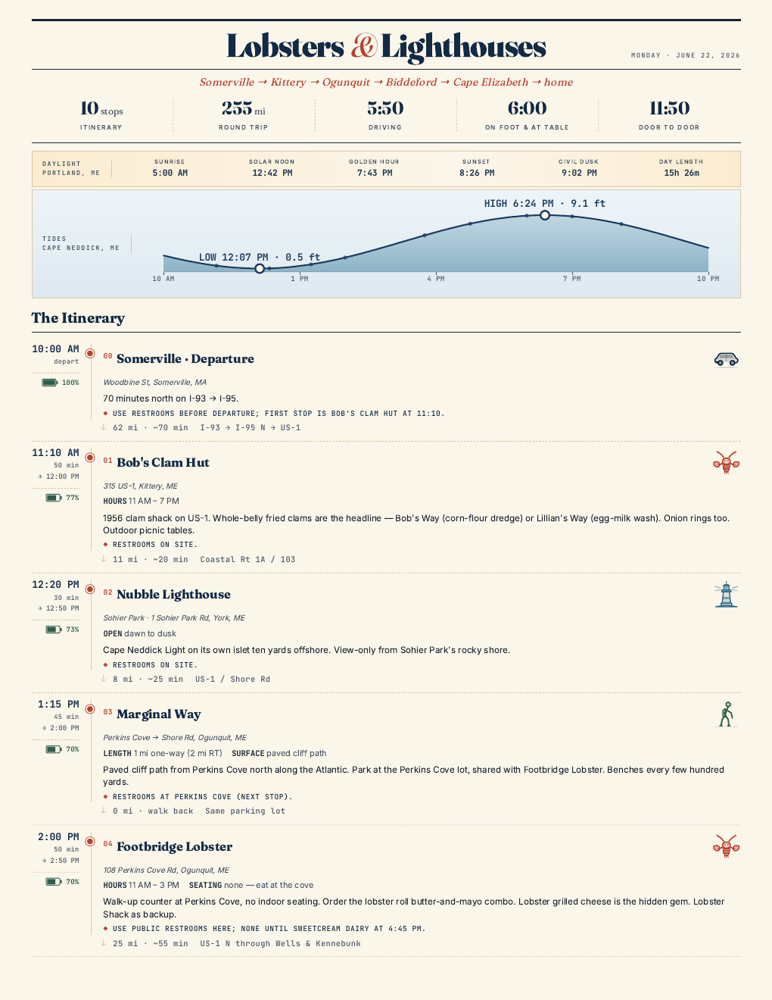

# Lobsters & Lighthouses

A one-sheet, in-car handout for a Maine coast day trip. Renders as both a
self-contained HTML page (works offline once loaded) and a two-page letter
PDF (front + back of a sheet of paper).



## What's in it

- 10-stop itinerary from Somerville, MA up the southern Maine coast and back
- Sunrise / golden hour / sunset / civil dusk
- Tide curve for the trip day (NOAA station 8419399, Cape Neddick)
- Per-stop battery projection for a Tesla Model Y Performance
- Restaurant/lighthouse notes, Google Maps deep links, route QR code

## Building

```sh
./run            # tests + HTML + PDF
./run build      # HTML + PDF (~5s — Chromium PDF render)
./run html       # HTML only (skip PDF, for fast CSS iteration)
./run test       # tests only
./run refresh    # rebuild with fresh NOAA tide data
```

The first build pulls a transient `uvx` env with `jinja2`, `astral`,
`qrcode`, `playwright`, `pypdf`, and `pytest`. NOAA tide responses cache
in `cache/`.

## Layout

| File | Role |
| --- | --- |
| `config.toml`     | Trip date, tide station, sun coords, car efficiency model |
| `stops.toml`      | 10 stops + their addresses, leg distances, notes, icons |
| `template.html.j2`| Jinja2 HTML skeleton |
| `style.css`       | All visual styling, inlined into the HTML at build time |
| `build.py`        | Loads data → computes sun/tides/SoC → renders HTML → renders PDF |
| `test_build.py`   | pytest suite (50 tests, ~3s) |
| `cache/`          | NOAA tide-fetch cache (regenerable, checked in) |
| `fonts/`          | JetBrains Mono TTFs (pinned vendored assets) |
| `build/`          | Output (`index.html`, `trip-handout.pdf`) — checked in, served by Netlify |

## Changing the trip date

Edit `date` in `config.toml` and rerun `./run build`. Sun, tides, and the
masthead update automatically. Stop times in `stops.toml` are wall-clock
strings and need to be re-checked if you move to a different day of the
week.

## PDF design notes

The build script auto-scales the page so the laid-out content fits in
exactly two letter pages. The split point is between stops 04 and 05
(after the lunch stop) — change `pdf.break_before_stop_index` in
`config.toml` to move it.
